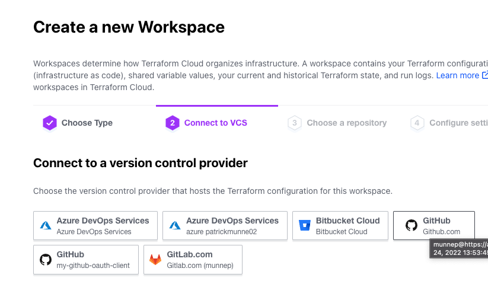

# tfc_use_module_private_registry

This repository describes how to use the private module created in Terraform Cloud. 

This example show the usage with a workspace using VCS workflow or just using it local

# Prerequesites

- Make sure you have created the private module as instructed [here](https://github.com/munnep/terraform-random-petname-private)

# How to

## use the module locally

- git clone
```
git clone https://github.com/munnep/tfc_use_module_private_registry.git
```
- go in directory
```
cd tfc_use_module_private_registry
```
- Alter the main.tf file to match the location of your private module
```
module "petname-private" {
  source  = "app.terraform.io/<your organization name>/<private-module_name>"
  version = "0.0.1"
  prefix = "patrick"
}
```
- terraform init
```
terraform init
```
- terraform apply
```
terraform apply
```
- Output showing

```

Apply complete! Resources: 1 added, 0 changed, 0 destroyed.

Outputs:

pet_name = "patrick-certain-monster"
```

## use the module with VCS driven workflow

- Fork this repository to your own environment
- Alter the main.tf file to match the location of your private module
```
module "petname-private" {
  source  = "app.terraform.io/<your organization name>/<private-module_name>"
  version = "0.0.1"
  prefix = "patrick"
}
```
- Login to Terraform Cloud
- Create a new workspace  
  
  
  
  
  
- Start a new run 
  
- We should see the output
  
